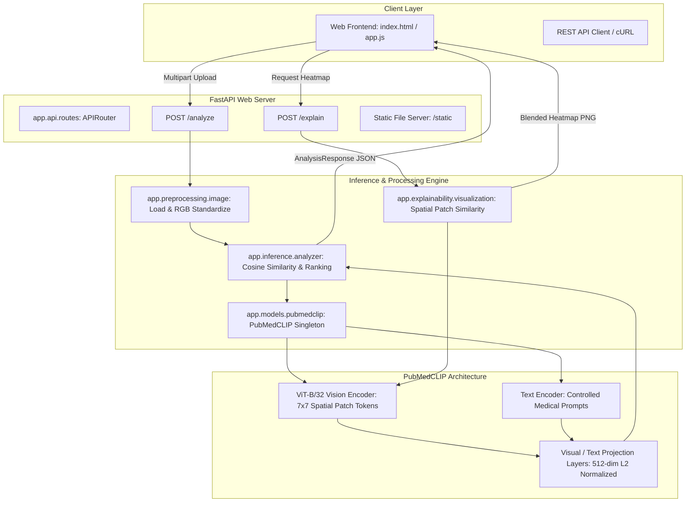

# Chest X-ray Finding Analyzer

An end-to-end research prototype and medical vision-language platform for zero-shot chest X-ray finding analysis, visual spatial attribution explainability, and multi-label threshold calibration powered by **PubMedCLIP** (`flaviagiammarino/pubmed-clip-vit-base-patch32`) and **FastAPI**.

> [!CAUTION]
> **RESEARCH & EDUCATIONAL PROTOTYPE NOTICE:**
> Chest X-ray Finding Analyzer is strictly an educational and research prototype. All confidence and similarity scores represent normalized vector dot-products in PubMedCLIP joint embedding space and are **NOT** clinically validated diagnostic probabilities. The software is not approved by FDA, CE, or any regulatory body for clinical use or diagnostic decision-making.

---

## 📐 End-to-End System Architecture



---

## 🚀 Quick Start Guide

### 1. Local Python Environment Setup

```powershell
# Activate virtual environment
.venv\Scripts\activate

# Launch development server
python -m uvicorn app.main:app --reload --port 8000
```

Access the application interface and documentation:
- **Interactive Web App**: [`http://127.0.0.1:8000/static/index.html`](http://127.0.0.1:8000/static/index.html)
- **Swagger Interactive API Documentation**: [`http://127.0.0.1:8000/docs`](http://127.0.0.1:8000/docs)
- **ReDoc API Documentation**: [`http://127.0.0.1:8000/redoc`](http://127.0.0.1:8000/redoc)

### 2. Docker Container Deployment

```bash
# Build and launch with Docker Compose
docker-compose up --build -d

# Check container health status
docker-compose ps
```

---

## 🗺️ Master Phase-by-Phase Progress (Phases 0–24)

| Phase | Description | Status | Verification Artifacts |
| :---: | :--- | :---: | :--- |
| **0** | Define project scope & research objectives | ✅ | Scope specification & disclaimers |
| **1** | Project directory structure setup | ✅ | Modular package hierarchy |
| **2** | Python virtual environment initialization | ✅ | Python 3.11/3.14 `.venv` setup |
| **3** | Dependency manifest & installation | ✅ | `requirements.txt` |
| **4** | FastAPI framework & app skeleton | ✅ | [`app/main.py`](file:///c:/Users/ASUS/mainproject/app/main.py) |
| **5** | Image upload endpoint implementation | ✅ | `POST /analyze` file handler |
| **6** | Image validation & preprocessing pipeline | ✅ | [`app/preprocessing/image.py`](file:///c:/Users/ASUS/mainproject/app/preprocessing/image.py) |
| **7** | PubMedCLIP model integration & singleton wrapper | ✅ | [`app/models/pubmedclip.py`](file:///c:/Users/ASUS/mainproject/app/models/pubmedclip.py) |
| **8** | Controlled medical prompt set construction | ✅ | 8 standard medical prompts in [`app/inference/analyzer.py`](file:///c:/Users/ASUS/mainproject/app/inference/analyzer.py) |
| **9** | Cosine similarity ranking engine | ✅ | PyTorch L2-normalized vector dot-products |
| **10** | Prototype confidence scoring | ✅ | Peak similarity extraction |
| **11** | Pydantic response JSON schema definition | ✅ | [`app/schemas/response.py`](file:///c:/Users/ASUS/mainproject/app/schemas/response.py) |
| **12** | End-to-end inference integration | ✅ | Integrated pipeline execution |
| **13** | Unit & API integration test suite | ✅ | `tests/test_preprocessing.py`, `test_pubmedclip.py`, `test_api.py` |
| **14** | Architecture walkthrough & system documentation | ✅ | [`walkthrough.md`](file:///C:/Users/ASUS/.gemini/antigravity-ide/brain/f8853583-e0ad-495d-b4d1-89e093208c40/walkthrough.md) |
| **15** | Benchmark dataset & ground truth label pipeline | ✅ | [`data/evaluation/dataset.py`](file:///c:/Users/ASUS/mainproject/data/evaluation/dataset.py) (16 images, `val`/`test` splits) |
| **16** | Zero-shot evaluation engine | ✅ | [`evaluation/evaluate.py`](file:///c:/Users/ASUS/mainproject/evaluation/evaluate.py), `predictions.csv`, `metrics.json`, 8 confusion matrices |
| **17** | Decision threshold calibration pipeline | ✅ | [`evaluation/calibrate.py`](file:///c:/Users/ASUS/mainproject/evaluation/calibrate.py), `threshold_sweep.csv`, `calibration_results.json` |
| **18** | Visual spatial explainability module | ✅ | [`app/explainability/visualization.py`](file:///c:/Users/ASUS/mainproject/app/explainability/visualization.py) ($7 \times 7$ spatial patch similarity heatmaps) |
| **19** | Structured findings schema update | ✅ | `FindingResult` (`rank`, `score`, `status`, `above_threshold`) |
| **20** | Web frontend application interface | ✅ | [`frontend/index.html`](file:///c:/Users/ASUS/mainproject/frontend/index.html), [`frontend/styles.css`](file:///c:/Users/ASUS/mainproject/frontend/styles.css) |
| **21** | Frontend + API integration & interactive explainability | ✅ | [`frontend/app.js`](file:///c:/Users/ASUS/mainproject/frontend/app.js), `POST /explain` PNG streaming |
| **22** | Complete system testing & resilience suite | ✅ | [`tests/test_system_complete.py`](file:///c:/Users/ASUS/mainproject/tests/test_system_complete.py) (38 passing tests) |
| **23** | Deployment configuration & containerization | ✅ | [`Dockerfile`](file:///c:/Users/ASUS/mainproject/Dockerfile), [`docker-compose.yml`](file:///c:/Users/ASUS/mainproject/docker-compose.yml), [`gunicorn.conf.py`](file:///c:/Users/ASUS/mainproject/gunicorn.conf.py) |
| **24** | Final documentation & presentation outline | ✅ | `README.md`, [`PRESENTATION.md`](file:///c:/Users/ASUS/mainproject/PRESENTATION.md) |

---

## 📡 API Endpoint Reference

| Method | Path | Content-Type | Description |
| :--- | :--- | :--- | :--- |
| `GET` | `/` | `application/json` | Basic API health & model initialization status |
| `GET` | `/health` | `application/json` | Detailed system status, compute device (CPU/CUDA), and model details |
| `POST` | `/analyze` | `multipart/form-data` | Upload chest X-ray image file to run zero-shot analysis & return ranked findings |
| `POST` | `/explain` | `multipart/form-data` | Upload chest X-ray image + finding name to generate visual spatial patch overlay PNG |
| `POST` | `/image-info` | `multipart/form-data` | Inspect image format, dimensions, and color mode without running inference |

### Sample Response (`POST /analyze`):
```json
{
  "status": "success",
  "model": {
    "name": "PubMedCLIP",
    "type": "zero-shot prototype"
  },
  "findings": [
    {
      "finding": "cardiomegaly",
      "score": 0.2535,
      "similarity_score": 0.2535,
      "rank": 1,
      "status": "candidate",
      "above_threshold": true,
      "explanation_available": true
    },
    {
      "finding": "normal",
      "score": 0.2523,
      "similarity_score": 0.2523,
      "rank": 2,
      "status": "candidate",
      "above_threshold": true,
      "explanation_available": true
    }
  ],
  "prototype_confidence": 0.2535,
  "threshold_used": 0.25,
  "explainability": {
    "available": true,
    "method": "CLIP-based spatial patch-text similarity attribution",
    "disclaimer": "The visualization represents model attention/similarity attribution and should not be interpreted as a clinically validated explanation of disease."
  },
  "disclaimer": "Research prototype. Not for clinical diagnosis."
}
```

---

## 🎯 Threshold Calibration Results (Phase 17)

Zero-shot similarity models often suffer from baseline threshold offset. To optimize decision boundaries:
1. **Grid Sweep**: Evaluated candidate thresholds in range $[0.15, 0.40]$ with step $0.01$ on the **Validation Split (`val`)**.
2. **Optimal Threshold Selection**: Identified optimal macro threshold ($0.2000$) and per-finding thresholds.
3. **Held-out Evaluation**: Evaluated performance on the held-out **Test Split (`test`)** to prevent data leakage.

### Held-Out Test Set Comparison

| Configuration | Threshold | Precision | Recall | Specificity | F1 Score |
| :--- | :--- | ---: | ---: | ---: | ---: |
| **Uncalibrated (Default)** | 0.2500 | 0.0000 | 0.0000 | 1.0000 | 0.0000 |
| **Calibrated (Macro F1)** | 0.2000 | 0.1295 | 1.0000 | 0.0357 | **0.2292** |
| **Calibrated (Per-Finding)** | Dynamic | 0.2534 | 1.0000 | 0.4107 | **0.3843** |

---

## 🧪 Comprehensive Test Suite

Run full automated test suite covering unit, integration, explainability, metrics, and system complete tests:

```powershell
.venv\Scripts\python.exe -m pytest
```

Output:
```text
======================= 38 passed, 2 warnings in 12.32s =======================
```

---

## 🛠️ Technology Stack

- **Core Logic & ML**: Python 3.11 / 3.14, PyTorch, Hugging Face Transformers (`flaviagiammarino/pubmed-clip-vit-base-patch32`).
- **Web Framework**: FastAPI, Uvicorn, Gunicorn process manager.
- **Frontend UI**: Vanilla HTML5, CSS3 (Dark Glassmorphism UI design system), JavaScript ES6+ fetch.
- **Explainability & Metrics**: Pillow, OpenCV, NumPy, Scikit-Learn.
- **Testing & Containerization**: Pytest, FastAPI TestClient, Docker, Docker Compose.
